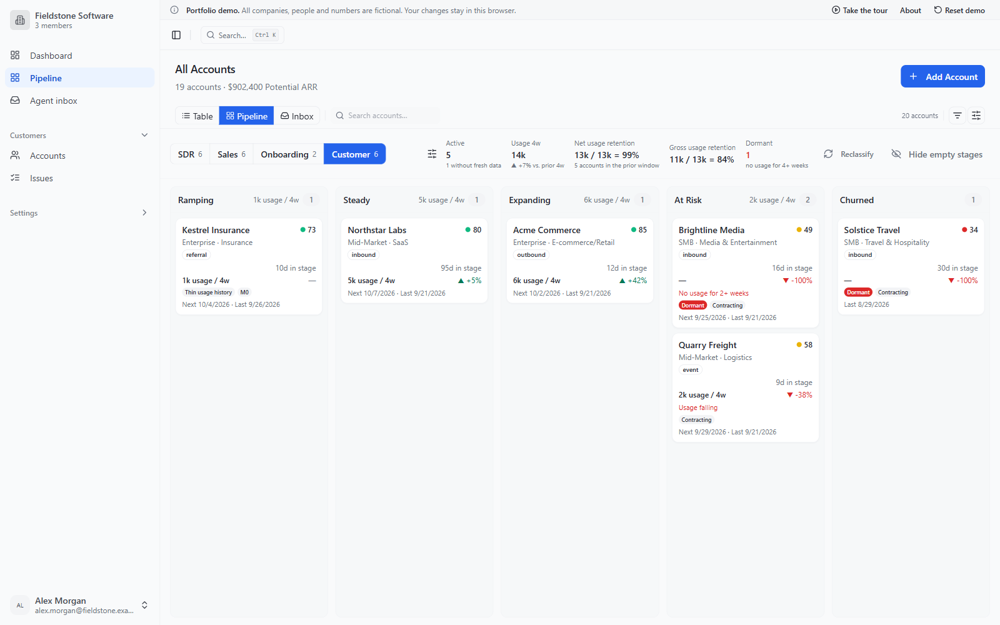
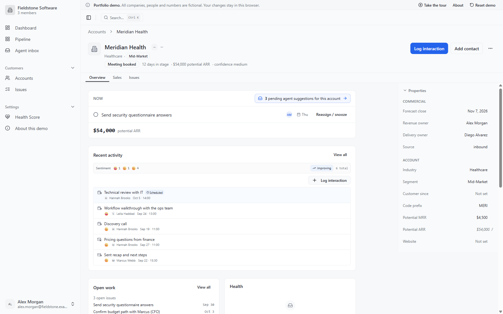
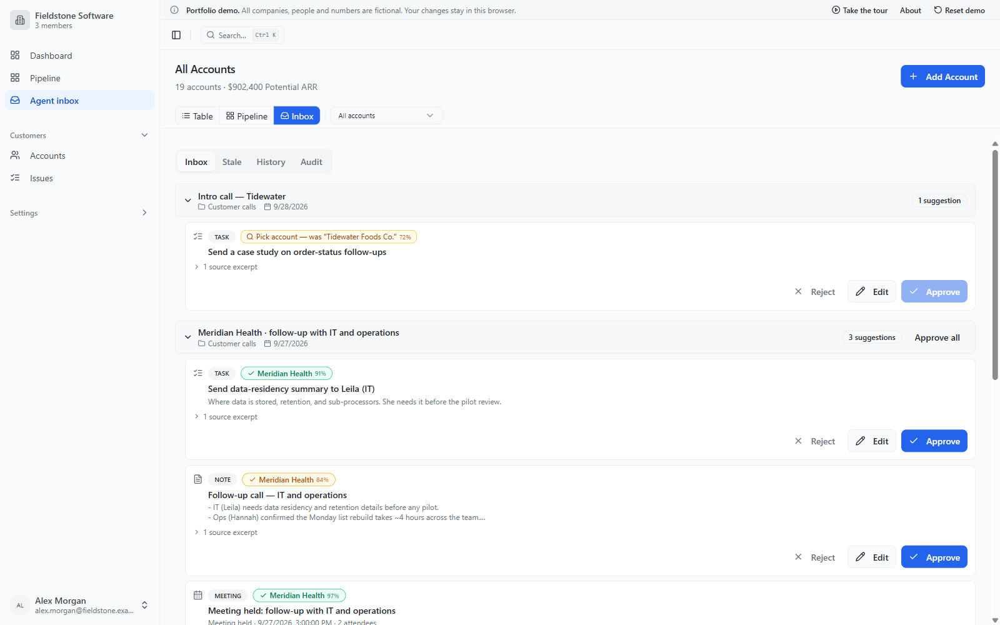
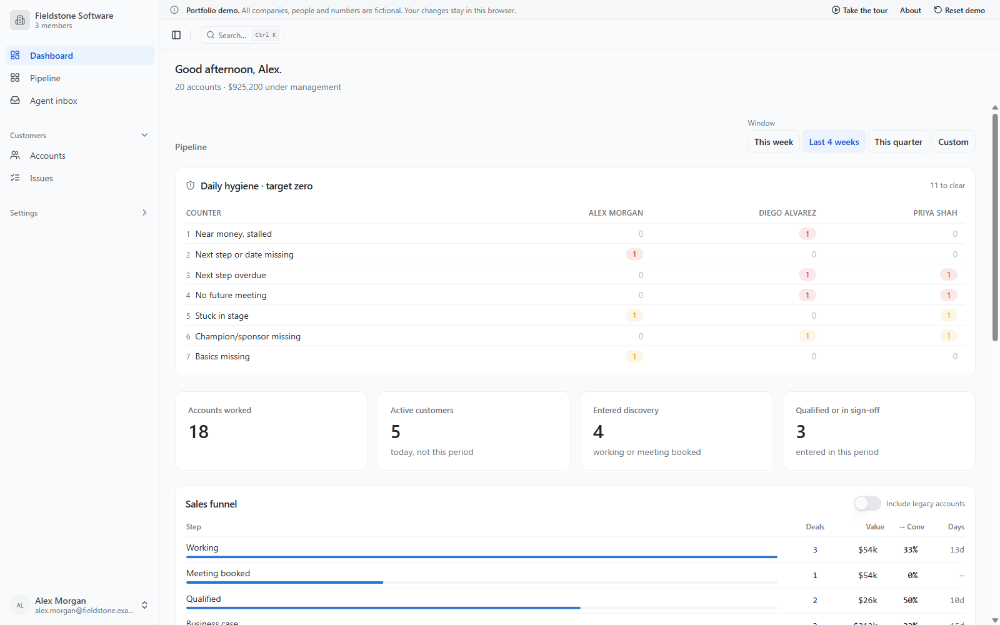
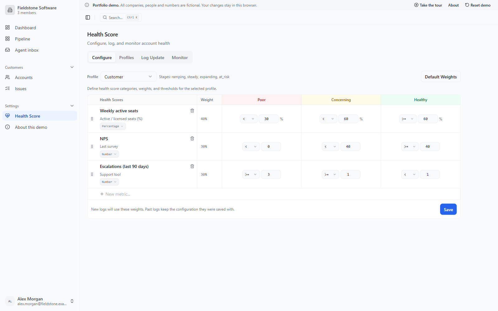

# Account Guardian

**A customer operations workspace: one board from first contact to churn, stage gates the
database enforces, configurable health scoring, and a meeting agent that proposes while a
person approves.**

**[Open the live demo →](https://account-guardian-demo.vercel.app)** · runs in your browser,
no sign-up, fictional data.



> A public, reduced version of an internal system I designed and built. All data is
> fictional.

## What I built

I designed and built Account Guardian end to end for a B2B startup: from the operating
model (how the team sells, onboards and retains customers), to the product rules that
encode it, to the application running in production. It was built with AI-assisted
development (Claude Code) on React, TypeScript and Supabase.

This repository is the portfolio edition: five of the product's areas, running entirely in
the browser on a fictional workspace, with the production schema documented alongside.

## What is in the demo

| | |
|---|---|
| **Lifecycle board** | One board from first contact to churn in four phases. SDR, Sales and Onboarding are funnels people move; Customer is a priority ladder the system files, with the reason on every card. |
| **Account workspace** | The account as the unit of work: next action and what blocks it, the qualification checklist, contacts, timeline, issues and health. |
| **Agent inbox** | Tasks, notes and activities extracted from meetings wait for a person to approve, edit or reject them. Every decision is audited. |
| **Health scoring** | Profiles per stage, metrics with thresholds and weights, and a snapshot of the rules stored with every log. |
| **Operations dashboard** | Hygiene counters that target zero, a flow funnel where "won" means first real usage, and loss reasons. |

<table>
<tr>
<td></td>
<td></td>
</tr>
<tr>
<td></td>
<td></td>
</tr>
</table>

## Three product decisions

1. **A funnel until the close, a ladder after it.** After the close there is no sequence
   left: a customer moves between Steady, Expanding and At Risk for as long as they are a
   customer. So the Customer columns are ordered by attention and filed by the system from
   usage, activity and health. Contraction and dormancy are badges, not columns, because
   five columns is the limit of a readable board. *Trade-off: no manual dragging after the
   close, for a board that does not lie.*
2. **The database enforces the rules; the interface warns while you type.** Stage exit
   criteria live in one SQL function that refuses skipped stages, unqualified deals and
   closes without an engaged decision maker. A pure client module mirrors the same rules
   to show the blocker on every keystroke. *Trade-off: two places to change a rule,
   protected by tests.*
3. **The agent proposes, a person approves.** Nothing extracted from a meeting reaches an
   account without review; every proposal, edit, approval and rejection is audited, and
   model spend has a monthly cap. *Trade-off: less magic, more trust.*

## How it is built

The production app is a React SPA on Supabase: Postgres with row-level security per
organization, SQL functions and triggers for the rules the UI must not skip, and edge
functions for the meeting agent.

The demo keeps the screens, hooks and queries unchanged apart from the client import, and
swaps the database client underneath for an in-memory one that speaks the same query API. The
SQL functions, triggers and views those screens depend on are ported to TypeScript and run
over a seeded, fictional workspace. Nothing leaves the browser.

Why: a free hosted database pauses after a week without traffic, and keeping one alive
brings sign-in, per-visitor data, clean-up and rate limits to a page whose only job is to
open. Details in [docs/architecture.md](docs/architecture.md).

**Where to look in the code**

| Path | What it shows |
|---|---|
| [`src/demo/`](src/demo) | The in-memory database: PostgREST-compatible query builder, triggers, views, the SQL functions ported to TypeScript, and the seed |
| [`src/lib/stageReadiness.ts`](src/lib/stageReadiness.ts) | Stage exit criteria, as the client mirror of the database gate |
| [`src/lib/customerSignals.ts`](src/lib/customerSignals.ts) | The customer ladder: risk rules in severity order, ramp window, expansion, badges, explanations |
| [`src/lib/hygieneCounters.ts`](src/lib/hygieneCounters.ts) | The zero-target counters and the owner × counter board |
| [`supabase/schema.sql`](supabase/schema.sql) | The production data model for these features: tables, RLS, functions, views, triggers |
| [`docs/case-study.md`](docs/case-study.md) | The short version of the story |

## Running locally

```bash
git clone https://github.com/luizrochaprojects-afk/account-guardian-demo.git
cd account-guardian-demo
npm install
npm run dev        # http://localhost:8080
```

Other scripts: `npm test`, `npm run typecheck`, `npm run lint`, `npm run build`.

To load the documented schema into a local Postgres 15+ database instead:

```bash
psql -d <database> -v ON_ERROR_STOP=1 -f supabase/schema.sql
```

## Stack

React 18 · TypeScript · Vite · TanStack Query · React Router · Tailwind CSS · shadcn/ui
(Radix) · Vitest · Testing Library. Production backend: Supabase (Postgres, row-level
security, SQL functions and triggers, edge functions).

## About the data

Every company, person, meeting, email address and number in this repository is invented.
Email domains use the reserved `.example` top-level domain. A sanitization check
(`scripts/check-sanitize.mjs`) scans the source, the production build and the git history for
anything that should not be here before anything is published.
